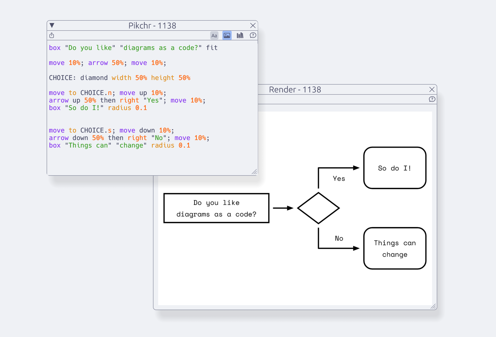
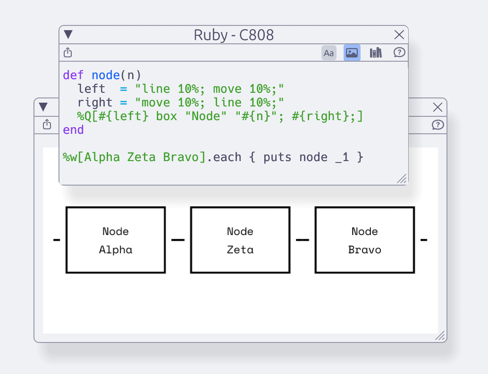
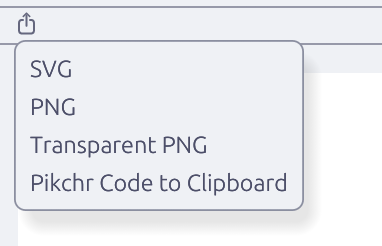
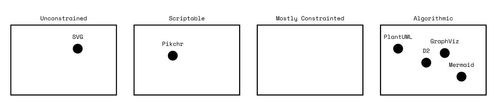

<p align="center">
  
</p>
<h1 align="center">DiagramIDE</h1>
<p align="center"><em>Diagrams as source files.</em></p>

DiagramIDE is a small workspace for writing [Pikchr] diagrams, previewing the
rendered result, and keeping related source fragments in one place. It is built
for users who prefer diagrams to remain inspectable as text.

A diagram may be written **directly** in Pikchr, **assembled** from named
fragments, or **generated** from a small program — Prolog DCGs, Tcl, or Ruby.
Rendered output can be exported as SVG, PNG, transparent PNG, or copied as
Pikchr source.

## Screenshots


*Direct Pikchr source and paired render window.*


*Ruby output used to generate Pikchr.*


*Export menu: SVG, PNG, transparent PNG, and Pikchr source.*

## Features

**Source**
- Pikchr editor with **live preview** — see the output (or errors) as you type.
- Plain-text fragments and named editors for reuse.

**Generation** — produce Pikchr from a small program when the structure is repetitive:
- **Prolog** — define diagrams as DCGs (root `diagram//0`); runs [Trealla Prolog] embedded via WASM.
- **Tcl** — concise text-transformation scripting; requires Tcl 8.6 libraries.
- **Ruby** — generate Pikchr through `print`/`puts`; requires Ruby available.

**Composition** — reference one editor from another:
- `$$name$$` — include another editor's *generated* Pikchr output.
- `!!name!!` — include another editor's *raw* source.

**Workspaces**
- Multiple related editors, render windows, and snippets in one place, with autosaving.

**Export**
- SVG · PNG (opaque) · PNG (transparent) · copy generated Pikchr source.
- Renders use the Space Mono font for crisp preview and PNG output.

## Workflow

1. **Write** — create the diagram in Pikchr, or generate Pikchr when the structure is repetitive.
2. **Inspect** — keep source and rendered diagram visible at the same time.
3. **Reuse** — move repeated shapes, labels, or layout fragments into named editors.
4. **Export** — produce an image or copy the generated source when the diagram is ready.

## Installation

Build from source (`cargo install --path .` installs DiagramIDE, the default root
binary) or grab a build from the [Nightly Release][nightly].

[nightly]: https://github.com/exlee/diagramide/releases/tag/latest

## Satellite projects

This repository is a Cargo workspace. **DiagramIDE** (at the repo root) is the
application; the following are satellite projects:

| Project | Crate · path | Role | License |
|---|---|---|---|
| **pikchr.pro** | `pikchr_pro` · `crates/pikchr_pro` | core Prolog→Pikchr→SVG library + CLI | GPL-3.0-only |
| **pikchr.pl** | `pikchr_pl` · `crates/pikchr_pl` | older iced-based GUI, superseded by DiagramIDE | GPL-3.0-only |
| `trealla-wasm` | `crates/trealla_wasm` | Trealla Prolog over WASM runtime | MIT |

### pikchr.pro (CLI)

`pikchr_pro` reads a Prolog file on STDIN (expecting a `diagram//0` DCG) and writes
the rendered SVG to STDOUT:

```
cat my_diagram.pl | pikchr_pro > output.svg
```

### pikchr.pl

The original iced-based GUI, now superseded by DiagramIDE (egui). It remains in-tree
and still ships in the nightly releases.

## Status: alpha

DiagramIDE works and can create and export diagrams, but it is not yet polished:

- Workspace autosaving works, but an update could wipe your workspace — keep backups.
- Some obvious things are missing (e.g. indenting selected lines, shortcuts for many actions).
- Expect code crumbs, verbose debugging, and undocumented behavior.

### Hidden features

- <kbd>Cmd/Ctrl</kbd>+<kbd>R</kbd> in an editor renames it.
- `$$EDITOR_NAME$$` embeds an editor's generated Pikchr in another editor.
- `!!EDITOR_NAME!!` embeds an editor's raw source in another editor.
- <kbd>Cmd/Ctrl</kbd>+click destroys a window (the × button only hides it).

## Wrapper languages

DiagramIDE currently embeds Tcl and Prolog for generation. There are two
requirements for a language to be integrated:

- It must be able to return text (valid Pikchr after transformation).
- It must be embeddable into Rust.

Prolog (Trealla, via WASM) was the first, since DCGs enable declarative diagrams
and composition through atoms. After writing a Prolog helper library (embedded
into `pikchr.pl`, not DiagramIDE itself) I found I'd often rather write raw Pikchr.

Tcl joined second — by accident, it turned out to be an excellent fit for the text
transformation DiagramIDE does. Other languages may follow (M4 as a macro layer,
Markdown for diagrams-plus-text); the deciding factor is Rust embeddability
(e.g. Starlark).

## Road to DiagramIDE



- I'm a fan of visual communication, but drawing diagrams (and updating them later) is hard.
- Most diagramming tools are constrained — you hit a wall where you accept subpar output or fight the tool.
- Graphics programs don't support composition: you can't declare "this is my node" and edit all instances.
- [Pikchr] is the closest fit, but its scripting is limited — no conditional logic, no smart loops.
- Pikchr renders to SVG without a font or background, making SVG hard to use in code, and rasterizing SVG cleanly is non-trivial.
- And in the end — it's nice to see where your diagram is at as you make it.

## LICENSE

**DiagramIDE** is licensed under the **Business Source License 1.1** (BSL). The
satellite projects **pikchr.pl** and **pikchr.pro** are licensed under the
**GPL-3.0-only**.

- **DiagramIDE** (`diagramide`, this crate) — Business Source License 1.1. Source-available; mandated/corporate use requires a commercial license. Converts to **GPL-3.0-or-later** on 2029-01-01. See [LICENSE](./LICENSE) and [NOTICE](./NOTICE).
- **pikchr.pl / pikchr.pro** (`pikchr_pl`, `pikchr_pro`) — GPL-3.0-only. See each crate's `LICENSE`.
- **trealla-wasm** (`trealla_wasm`) — MIT. See its `LICENSE`.
- **Space Mono font** — SIL Open Font License 1.1. See [`assets/fonts/LICENSE.SpaceMono`](./assets/fonts/LICENSE.SpaceMono).
- **Trealla Prolog** — MIT-style license. See [`crates/trealla_wasm/native/tpl/LICENSE`](./crates/trealla_wasm/native/tpl/LICENSE).
- **Pikchr** — the author disclaims copyright (zero-clause BSD). See the header of [`crates/pikchr_pro/native/pikchr/pikchr.c`](./crates/pikchr_pro/native/pikchr/pikchr.c).

[Pikchr]: https://pikchr.org
[Trealla Prolog]: https://github.com/trealla-prolog/trealla
