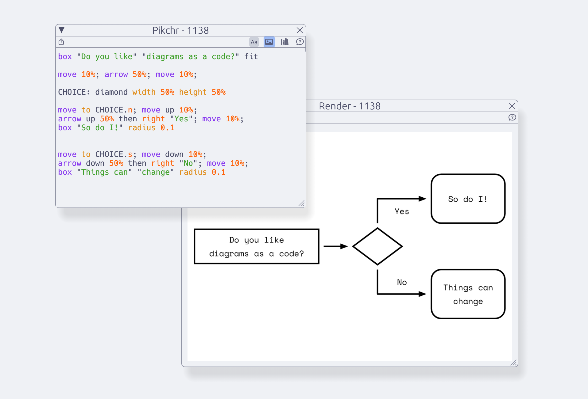
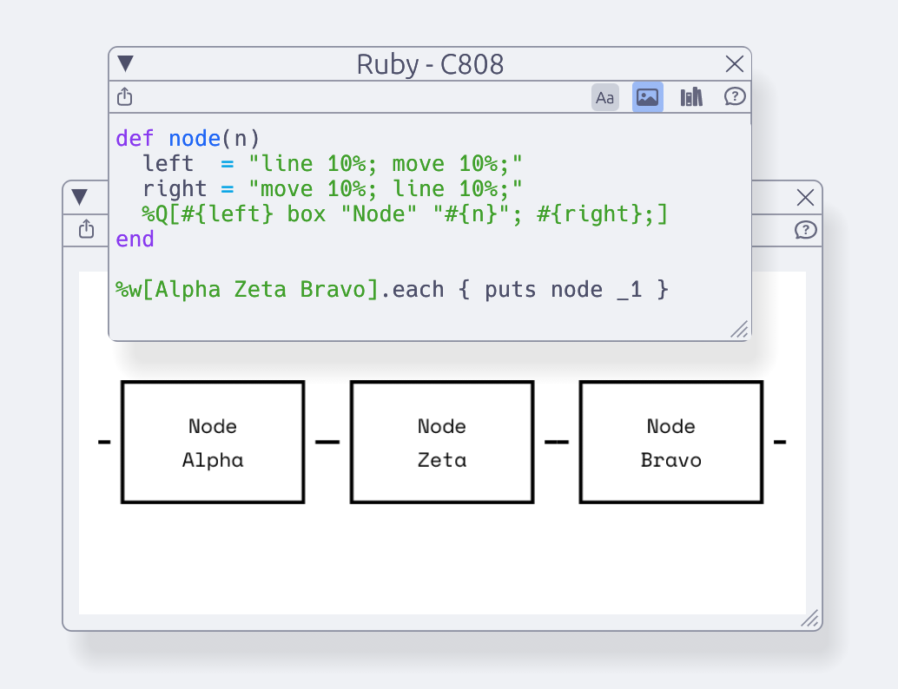
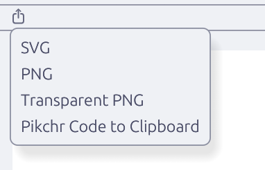
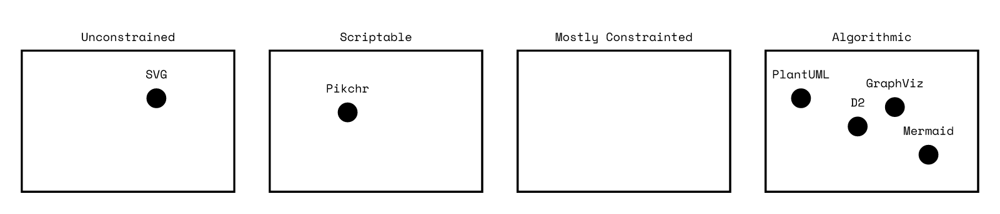

<p align="center">
  
</p>
<h1 align="center">DiagramIDE</h1>
<p align="center"><em>Diagrams as source files.</em></p>

DiagramIDE is a workspace for writing [Pikchr] or [Svgbob] diagrams as text,
with a live preview beside the source.

Write a diagram directly, assemble it from named fragments, or generate it from
a program in Prolog, Tcl, Ruby, or CLIPS. Each diagram editor has an Output Type
of Pikchr (the default) or Svgbob. You can save SVG, PNG, transparent PNG, or
the generated source to a file or copy it to the clipboard.

## Screenshots


*Pikchr source and its render window.*


*Ruby script that generates Pikchr.*


*Export menu.*

## Features

**Source**
- Source editor with live preview. Choose Pikchr or Svgbob per editor.
- Svgbob canvas editor for ASCII art.
- **Hagoromo** editor: a [Gluon] script builds a diagram from combinators in the
  style of Haskell [Diagrams] (`circle 1.0 ||| square 2.0 |> fc color.red`),
  rendered in-process by [hagoromo]. The script is the diagram, so the editor
  has no Output Type.
- Plain-text editors hold fragments for reuse.

**Generation**
- **Prolog**: define the diagram as a DCG with root `diagram//0`. Runs on
  [Trealla Prolog] embedded through WASM.
- **Tcl**: script text transformations. Requires Tcl 8.6 libraries.
- **Ruby**: write source with `print` or `puts`. Requires Ruby.
- **CLIPS**: assert facts such as `(box (id b) (label "Hello"))` and let rules
  add more. Each shape fact becomes 1 Pikchr statement and learns its
  rendered centre in `x` and `y`. Runs the embedded
  [CLIPS] 6.4.2 engine through [clips-bindings].

**Composition**
- `$$name$$` includes another editor's generated source. Both editors need the
  same Output Type.
- `!!name!!` includes another editor's raw source.

**Workspaces**
- Keep related editors, render windows, and fragments together. Workspaces
  save automatically.

**Export**
- SVG, opaque PNG, and transparent PNG.
- Copy generated Pikchr, Svgbob, or Hagoromo source.
- Renders use the Space Mono font.

## Installation

Build from source with `cargo install --path .`, download the
[1.1.0 release][release-1-1-0], or try the [nightly release][nightly].

[release-1-1-0]: https://github.com/exlee/diagramide/releases/tag/v1.1.0
[nightly]: https://github.com/exlee/diagramide/releases/tag/latest

## Satellite projects

The repository is a Cargo workspace. The root crate is DiagramIDE. The other
crates are:

| Project | Crate · path | Role | License |
|---|---|---|---|
| **pikchr.pro** | `pikchr_pro` · `crates/pikchr_pro` | Prolog to Pikchr to SVG library and CLI | GPL-3.0-only |
| **pikchr.pl** | `pikchr_pl` · `crates/pikchr_pl` | Older iced GUI, replaced by DiagramIDE | GPL-3.0-only |
| `trealla-wasm` | `crates/trealla_wasm` | Trealla Prolog on a WASM runtime | MIT |

### pikchr.pro (CLI)

`pikchr_pro` reads a Prolog file with a `diagram//0` DCG on STDIN and writes
SVG to STDOUT:

```
cat my_diagram.pl | pikchr_pro > output.svg
```

### pikchr.pl

The original iced GUI. DiagramIDE (egui) replaces it, but it stays in the tree
and ships in nightly releases.

## Status: alpha

DiagramIDE creates and exports diagrams, but it isn't polished:

- An update can wipe your autosaved workspace. Keep backups.
- Some features are missing, such as indenting selected lines and shortcuts for
  many actions.
- Expect leftover code, verbose debug output, and undocumented behavior.

### Hidden features

- <kbd>Cmd/Ctrl</kbd>+<kbd>R</kbd> renames the focused editor.
- <kbd>Cmd/Ctrl</kbd>+select the × button to delete a window. Without the
  modifier, the button hides it.

## Wrapper languages

A language can join DiagramIDE if it meets 2 requirements:

- It returns text valid for the editor's Output Type.
- It embeds in Rust.

Prolog (Trealla on WASM) came first, because DCGs make diagrams declarative and
atoms make them composable. After writing a Prolog helper library (embedded in
`pikchr.pl`, not DiagramIDE), I found I often preferred raw Pikchr.

Tcl came second, and turned out to suit the text transformation DiagramIDE does.
Other candidates are M4 as a macro layer and Markdown for diagrams with text.
Rust embeddability decides, as with Starlark.

## Why DiagramIDE



- Diagrams communicate well, but drawing and updating them is hard.
- Most diagramming tools hit a limit where you accept poor output or fight the
  tool.
- Graphics programs lack composition. You can't define a node once and edit
  every instance.
- [Pikchr] fits best, but its scripting has no conditionals and limited loops.
- Pikchr SVG has no font or background, so it's hard to use in code, and
  rasterizing it well takes work.
- You want to see the diagram while you write it.

## License

**DiagramIDE** uses the **Business Source License 1.1** (BSL). The satellite
projects **pikchr.pl** and **pikchr.pro** use **GPL-3.0-only**.

- **DiagramIDE** (`diagramide`, root crate): Business Source License 1.1. Source-available; mandated or corporate use requires a commercial license. Converts to **GPL-3.0-or-later** on 2029-01-01. See [LICENSE](./LICENSE) and [NOTICE](./NOTICE).
- **pikchr.pl and pikchr.pro** (`pikchr_pl`, `pikchr_pro`): GPL-3.0-only. See each crate's `LICENSE`.
- **trealla-wasm** (`trealla_wasm`): MIT. See its `LICENSE`.
- **Space Mono font**: SIL Open Font License 1.1. See [`assets/fonts/LICENSE.SpaceMono`](./assets/fonts/LICENSE.SpaceMono).
- **Tabler Icons**: MIT. See [`assets/icons/LICENSE.Tabler`](./assets/icons/LICENSE.Tabler).
- **Trealla Prolog**: MIT-style license. See [`crates/trealla_wasm/native/tpl/LICENSE`](./crates/trealla_wasm/native/tpl/LICENSE).
- **Pikchr**: the author disclaims copyright (zero-clause BSD). See the header of [`crates/pikchr_pro/native/pikchr/pikchr.c`](./crates/pikchr_pro/native/pikchr/pikchr.c).
- **hagoromo** and **Gluon**: MIT.
- **CLIPS** 6.4.2: MIT No Attribution. **clips-bindings**: MIT.
- **Svgbob**: Apache-2.0, pinned to the [`exlee/svgbob` optimization revision](https://github.com/exlee/svgbob/tree/axk-optimization-work).

[Pikchr]: https://pikchr.org
[Svgbob]: https://github.com/ivanceras/svgbob
[hagoromo]: https://crates.io/crates/hagoromo
[CLIPS]: https://clipsrules.net
[clips-bindings]: https://crates.io/crates/clips-bindings
[Gluon]: https://gluon-lang.org
[Diagrams]: https://diagrams.github.io
[Trealla Prolog]: https://github.com/trealla-prolog/trealla
