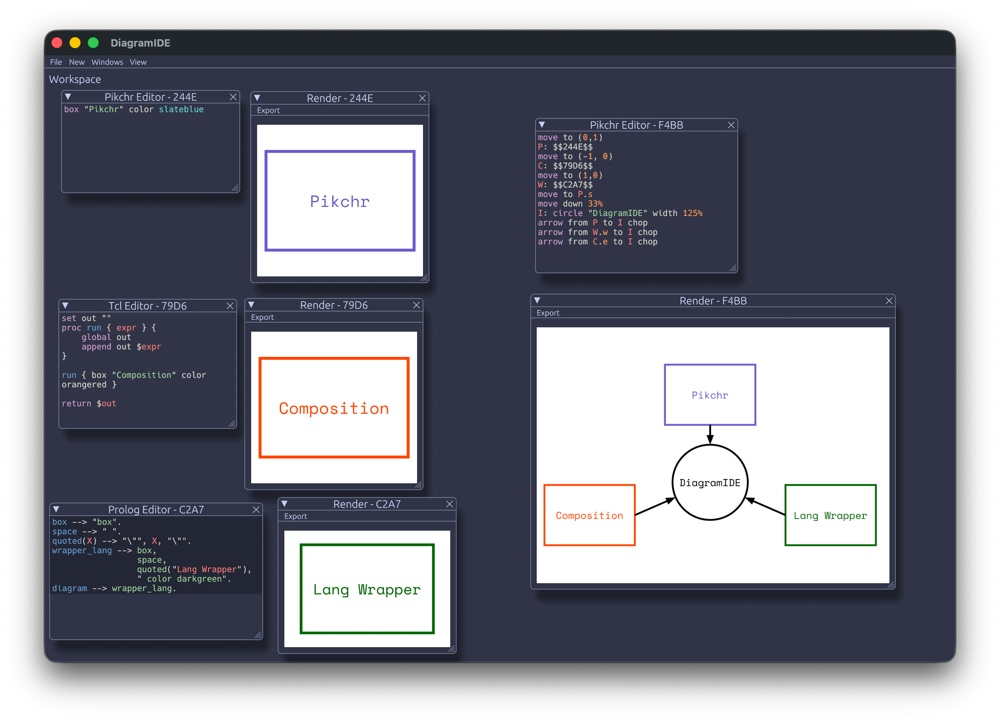

# DiagramIDE (alpha)

DiagramIDE is programatic diagram editor that allows definition and composition of diagrams using Pikchr diagram language, Prolog's DCGs or TCL for semi-generation of final diagrams.

In short - assuming you know some [Pikchr](https://pikchr.org) you can use it to live-render diagrams written on it or use Prolog and TCL to semi-script it to return rich, composable and (objectively) nicely looking diagrams more easily than you'd do that with visual editors.

## Installation

See [Nightly Release](https://github.com/exlee/pikchr.pl/releases/tag/latest) or clone repository and build it yourself

## Features

- **Live View** - see the output (or errors :)) live as you type in your diagram
- **Pikchr Support** - Pikchr is a base diagramming language and it can be used directly as a way to form a diagram
- **Prolog Support** - Possibility to define diagrams as DCGs with a root atom being a `diagram//0` DCG. Implemented through Trealla Prolog embedding through WASM.
- **TCL Support** - TCL is somewhat a niche language but it can be learned in 15 minutes and helps transforming abstract ideas into Pikchr code. Requires TCL 8.6 libraries to be found.
- **Cross-window referencing** - Code from other windows can be included through use of `$$NAME$$` or `!!NAME!!` operators. Former includes generated Pikchr code, latter includes raw source code.
- **SVG/PNG Export** - Might not sound impressive but getting nice PNG render out of Pikchr (or any SVG) isn't that easy feat.
- **Space Mono Font** - used for preview but also for PNGs

## Alpha

What does it mean that DiagramIDE is in alpha? 

- It works. It can be used to create and export diagrams.
- It's not yet a polished experience (e.g. workspace autosaving works but any updates could wipe your workspace completely... :/)
- All the bugs are included.
- Some obvious things are missing, like indenting selected lines in editor or shortcuts for _\<MOST_OF_THE_THINGS\>_.
- There might be code crumbs left behind, verbose debugging messages etc.
- Some features might be undocumented

## Undocumented features

- CMD/CONTROL - R in Editor allows renaming it
- Resulting Pikchr code can be embedded in other editor through `$$EDITOR_NAME$$` syntax
- Raw editor code can be embedded in other editor through `!!EDITOR_NAME!!` syntax
- Click with CMD/CONTROL destroys the window (clicking on X only hides it)

## Road to DiagramIDE

- I'm a fan of visual communication, but drawing diagrams (and updating them later!) is difficult
- Most of the diagramming solutions I've used are constrained to some degree. It's easy to hit a wall where you either accept subpar visualization or put significant effort in working around limitations.
- On the other hand, graphical programs don't support composition - it's impossible to make a declaration "this is my node" and then edit it updating all instances
- Pikchr being the closest to all falls short due to very limited scripting capabilities. It's good at simple definitions, but then it's impossible to have conditional logic, smart loops, etc. 
- Another problem is rendering - Pikchr renders to SVG, without font or even background - this makes SVG hard to use in coded environment. Rendering raster images of SVG is not a simple feat.
- And in the end - it's nice to see where your diagram is at as you make it.
  

## Wrapper Languages

DiagramIDE for now allows for use of TCL and Prolog for their environment. This list is for now, and I'd consider even more possible environments. 

There are two requirement for the language to be integrated into environment:
- It has to be able to return text (that would be valid Pikchr text after transformation)
- It needs to be embeddable into Rust

Prolog (running on Trealla Prolog through WASM) was the first choice as Prolog DCGs give capability of declarative diagrams and composition of diagrams through atoms. After spending some time developing library for Prolog (which is _not_ included in DiagramIDE, but is embedded into Pikchr.pl) I noticed that I'd rather implement diagrams in raw Pikchr than use Prolog for it. 

At some point I (by complete accident) learned about TCL and figured that's very nice language to use for text transformation - exactly what DiagramIDE is doing, which made it the second integrated language.

It's possible that other languages will join the fray. As of the moment of writing these words I'm considering M4 as yet another macro language next to TCL, and Markdown for Diagrams+Text document generation. I don't think there are any fully-grown programming languages that would suit the task, but this might change, especially if language is embeddable in Rust (e.g. Starlark).

## LICENSE

DiagramIDE is licensed under BUSL-1.1, see [NOTICE](./NOTICE) for details.